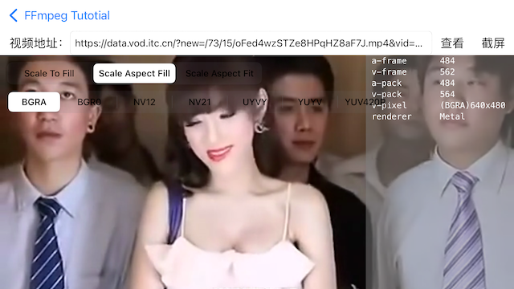
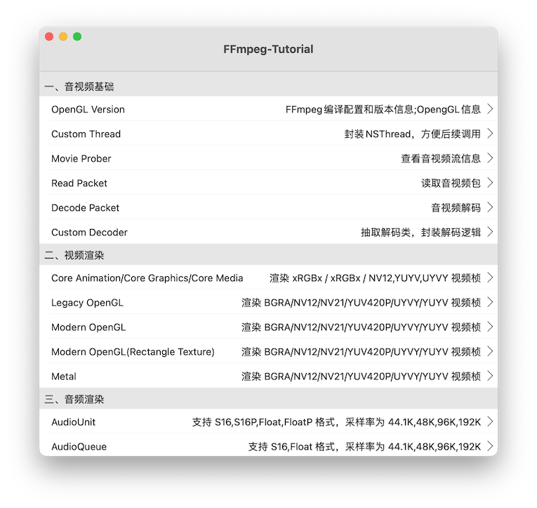

[](https://ffmpeg.org/) 


> 了解底层音视频技术是很有必要的，为了让更多零基础的 iOS/macOS 开发人员少走弯路，我编写了这个使用 FFmpeg 封装播放器系列教程，非常适合零基础的 iOS/macOS 开发者学习。 
> 
> 喜欢的老铁给个 Star 吧（先别着急 fork，现阶段会经常更新）。

[](https://github.com/debugly/FFmpegTutorial/stargazers)

## Usage

#### 1、运行 iOS 示例工程:

```bash
git clone https://github.com/debugly/FFmpegTutorial.git
cd FFmpegTutorial/Example/iOS
pod install
open FFmpegTutorial-iOS.xcworkspace
```

运行效果：





#### 2、运行 macOS 示例工程:

```bash
git clone https://github.com/debugly/FFmpegTutorial.git
cd FFmpegTutorial/Example/macOS
pod install
open FFmpegTutorial-macOS.xcworkspace
```




# Introduction

为方便管理依赖，项目使用 Pod 开发库（Development Pod）的形式来组织，所有对 FFmpeg 的封装代码都放在 FFmpegTutorial 库里，如何编译 FFmpeg 不是本教程的重点，因此我把编译好的 FFmpeg 库也做成了 Pod 库，编译 FFmpeg 等库的脚本在这里开源 [MRFFmpegPod](https://github.com/debugly/MRFFToolChainPod)。

教程提供了 iOS 和 macOS 的上层调用示例，开发语言为 Objective-C，工程目录结构如下：

```
├── Example
│   ├── iOS //iOS 示例工程
│   │   ├── FFmpegTutorial-iOS
│   │   ├── FFmpegTutorial-iOS.xcodeproj
│   │   ├── FFmpegTutorial-iOS.xcworkspace
│   │   ...
│   └── macOS //macOS 示例工程
│       ├── FFmpegTutorial-macOS
│       ├── FFmpegTutorial-macOS.xcodeproj
│       ├── FFmpegTutorial-macOS.xcworkspace
│       ...
├── FFmpegTutorial //对 FFmpeg 的封装
│   └── Classes
│       ├── 0x01  //查看编译时配置信息、支持的协议、版本号
│       ├── ...
│       └── common //通用类
├── FFmpegTutorial.podspec
└── md  //教程配套文档        
```

# Anti-Illiteracy

- 0x01：[常见封装格式介绍](md/illiteracy/0x01.md)
- 0x02：[播放器总体架构设计](md/illiteracy/0x02.md)
- 0x03：[封装 NSThread，支持 join](md/illiteracy/0x03.md)
- 0x04：[AVFrame 内存管理分析](md/illiteracy/0x04.md)

# FFmpegTutorial

教程共分为六个部分，其中第六部分是独立的仓库：

一、音视频基础

- 0x00：[FFmpeg简介及编译方法]
- 0x01：[查看编译时配置信息、支持的协议、版本号;OpengGL信息]
- 0x02：[封装NSThread，方便后续调用]
- 0x03：[查看音视频流信息]
- 0x04：[读取音视频包]
- 0x05：[音视频解码]
- 0x06：[抽取解码类，封装解码逻辑]

二、视频渲染

- 0x10：[使用 Core Graphics 渲染视频帧]
- 0x11：[使用 Core Animation 渲染视频帧]
- 0x12：[使用 Core Image 渲染视频帧]
- 0x13：[使用 Core Media 渲染视频帧]
- 0x14：[使用 OpenGL 渲染 NV12 视频帧]
    - 0x14-1：[抽取 OpenGLCompiler 类，封装 OpenGL Shader 相关逻辑]
    - 0x14-2：[渲染 YUV420P]（Mac Only）
    - 0x14-3：[渲染 UYVY422]（Mac Only）
    - 0x14-4：[渲染 YUYV422]（Mac Only）
    - 0x14-5：[渲染 NV21]（Mac Only）
- 0x15：[使用 OpenGL 3.3 渲染视频帧，两种上传纹理方式随时切换]
    - 0x15-1：[渲染 NV12]
    - 0x15-2：[渲染 YUV420P]（Mac Only）
    - 0x15-3：[渲染 UYVY422]（Mac Only）
    - 0x15-4：[渲染 YUYV422]（Mac Only）
    - 0x15-5：[渲染 NV21]（Mac Only）
- 0x16：[使用 FBO 离屏渲染截图]（Mac Only）
- 0x17：[TODO:使用 Metal 渲染视频桢]

三、音频渲染

- 0x20：[使用 AudioUnit 渲染音频桢，支持 S16、S16P、FLT、FLTP 四种采样深度格式]
- 0x21：[使用 AudioQueue 渲染音频桢，支持 S16、FLT 两种采样深度格式]
- 0x22：[封装音频渲染器，屏蔽内部实现细节]

四、封装播放器

- 0x30：[TODO:读包和解码之间增加 AVPacket 缓存队列]
- 0x31：[TODO:解码和渲染之间增加 AVFrame 缓存队列]
- 0x32：[TODO:音视频同步]
- 0x33：[TODO:显示播放进度和时长]
- 0x34：[TODO:支持暂停和播放]
- 0x35：[TODO:支持Seek]
- 0x36：[TODO:支持指定播放开始位置]
- 0x37：[TODO:使用硬件加速解码]

五、趣味实验

- 0x40：[黑白电视机雪花屏、灰色色阶图] 

六、实用工具

- 高效视频抽帧器：[MRVideoToPicture](https://github.com/debugly/MRVideoToPicture)


## Cross-platform

本教程的终极目标是写一款跨平台播放器，考虑到这是一项庞大的工程，本教程仅实现最基础的功能。

播放器更多丰富的功能则站在 B 站开源的 ijkplayer 肩膀上进行二次开发，我已经从 iOS 平台移植到了 macOS 平台：[ijkplayer](https://github.com/debugly/ijkplayer) ，增加了字幕、视频旋转等功能，最主要的是重构了视频渲染逻辑，值得一看！

## Ends

- Please give me an issue or a star or pull request！
- New members are always welcome!

Good Luck,Thank you！
