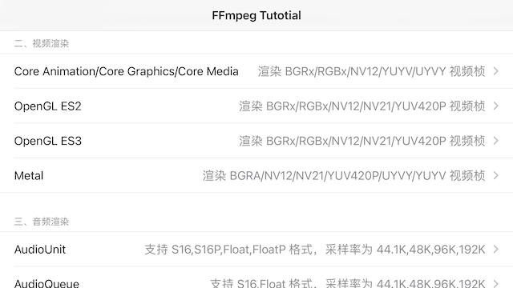
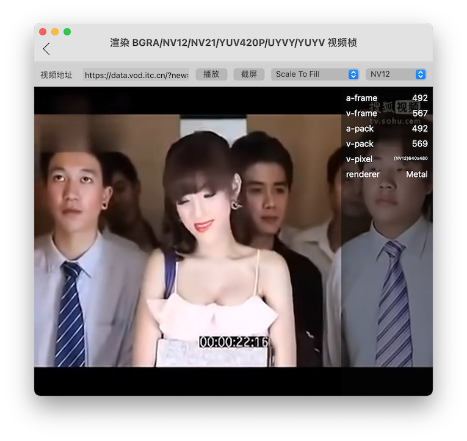
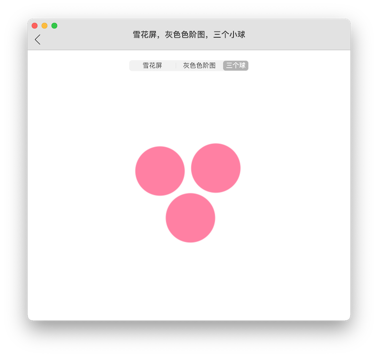

[](https://ffmpeg.org/) 

> 了解底层音视频技术是很有必要的，为了让更多零基础的 iOS/macOS 开发人员少走弯路，我编写了这个使用 FFmpeg 封装播放器系列教程，非常适合零基础的 iOS/macOS 开发者学习。 
> 
> 喜欢的老铁给个 Star 吧（先别着急 fork，现阶段会经常更新）。

[](https://github.com/debugly/FFmpegTutorial/stargazers)

# Usage

## iOS 示例工程:

```bash
git clone https://github.com/debugly/FFmpegTutorial.git
cd FFmpegTutorial/Example/iOS
pod install
open FFmpegTutorial-iOS.xcworkspace
```

运行效果:




## macOS 示例工程:

```bash
git clone https://github.com/debugly/FFmpegTutorial.git
cd FFmpegTutorial/Example/macOS
pod install
open FFmpegTutorial-macOS.xcworkspace
```






## Introduction

为方便管理依赖，项目使用 Pod 开发库（Development Pod）的形式来组织，所有对 FFmpeg 的封装代码都放在 FFmpegTutorial 库里，如何编译 FFmpeg 不是本教程的重点，因此我把编译好的 FFmpeg 库也做成了 Pod 库，编译 FFmpeg 等库的脚本在这里开源 [MRFFmpegPod](https://github.com/debugly/MRFFToolChainPod)。

教程共分为六个部分，提供了 iOS 和 macOS 的上层调用示例，使用 Objective-C 语言开发:

一、音视频基础

- OpenGL Version:查看编译时配置信息、支持的协议、版本号;OpengGL信息
- Custom Thread:封装 NSThread，方便后续调用
- Movie Prober:查看音视频流信息
- Read Packet:读取音视频包
- Decode Packet:音视频解码
- Custom Decoder:抽取解码类，封装解码逻辑

二、视频渲染

- Core API:使用 Core Graphics/Core Image/Core Media 渲染视频帧
- Legacy OpenGL/OpenGL ES2:渲染 BGRA/NV12/NV21/YUV420P/UYVY/YUYV 视频桢
- Modern OpenGL/OpenGL ES3:渲染 BGRA/NV12/NV21/YUV420P/UYVY/YUYV 视频桢
- Modern OpenGL(Rectangle Texture):渲染 BGRA/NV12/NV21/YUV420P/UYVY/YUYV 视频桢
- Metal:渲染 BGRA/NV12/NV21/YUV420P/UYVY/YUYV 视频桢

三、音频渲染

- AudioUnit:支持 S16,S16P,Float,FloatP 格式，采样率支持 44.1K,48K,96K,192K
- AudioQueue:支持 S16,Float格式，采样率支持 44.1K,48K,96K,192K
- 封装 AudioUnit 和 AudioQueue 渲染逻辑，调用者无需感知

四、封装播放器

- 0x30:增加 VideoFrame 缓存队列，不再阻塞解码线程
- 0x31:增加 AVPacket 缓存队列，创建解码线程
- 0x32:创建视频渲染线程，将视频相关逻辑封装到播放器内
- 0x33:将音频相关逻辑封装到播放器内
- 0x34:显示音视频播放进度
- 0x35:音视频同步
- 0x36:开始，结束，暂停，续播
- 0x37:(TODO)使用硬件加速解码
- 0x38:(TODO)使用将硬件解码数据快速上传至矩形纹理，避免拷贝解码数据
- 0x39:(TODO)两种方式将软解解码数据格式封装成 CVPixelBuffer
- 0x3a:(TODO)统一软硬解渲染逻辑
- 0x3b:(TODO)支持 Seek
- 0x3c:(TODO)支持从指定位置处播放
- 0x40:iOS和Mac公用一套渲染逻辑（TODO）

五、趣味实验

- 黑白电视机雪花屏、灰色色阶图、三个小球

六、实用工具

- 高效视频抽帧器:[MRVideoToPicture](https://github.com/debugly/MRVideoToPicture)

## Cross-Platform

本教程的终极目标是写一款跨平台播放器，考虑到这是一项庞大的工程，本教程仅实现最基础的功能。

完整的播放器功能则在 B 站开源的 ijkplayer 之上进行二次开发，我已经从 iOS 平台移植到了 macOS 平台 : [ijkplayer](https://github.com/debugly/ijkplayer) ，增加了字幕、视频旋转等功能，最主要的是重构了视频渲染逻辑，值得一看！

## Ends

- Please give me an issue or a star or pull request！
- New members are always welcome!

Good Luck,Thank you！
